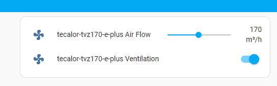

# Control ventilation systems 

(e.g. Tecalor TVZ170 TVZ 370, Wolf CWL-300/400 Excellent)

See [Home Assistant community thread](https://community.home-assistant.io/t/pcb-design-esp32-to-can-supporting-esphome-matter/549125/14) for more PCB development insights.

**Sorry, wrote following text in german it for the forum "Haustechnikdialog". Will translate, soon :)**

Die Leiterplatte dazu habe ich hier veröffentlicht: https://github.com/mkaiser/ESP32-CAN (der aktuelle Stand dort ist buggy. Hab ein paar PCB-Änderungen gefädelt. Eine fehlerbereinigte Variante kommt bald...)

Die Tecalor TVZ 170 scheint - was die Elektronik anbelangt ziemlich baugleich mit der Wolf CWL-300/400 Excellent zu sein.
Jedenfalls sind die Tabellen mit den Parameter Einstellungen komplett identisch. (bei Wolf heißen die Parameter nur "Schritt Nr")
Die Wolf Beschreibung liefert netterweise deutlich mehr Informationen drum herum.

Tecalor TVZ 170 (370) e Plus Bedienungsanleitung:

Wolf CWL-300/400 Excellent Bedienungsanleitung:

- Bei Verwendung zweier Schalteingänge hat der Schaltkontakt 1 (X15-1 & X15-2) immer Vorrang vor dem Schaltkontakt 2 (X15-3 & X15-4).
- Bei Anwendung zweier 0-10V-Eingänge hat der 0-10V-Eingang mit dem höchsten Luftdurchsatz immer Vorrang.

- Bei Wolf Seite 31 ist die Pinzuordnung auf den Steckverbinder X15 gezeigt.
Es gibt 2 Anschlussblöcke. Einen mit 8 Pins und einen mit 2 Pins.
Anschluss X15-1 ist direkt neben dem Anschlussblock mit 2 Pins.

- X15-1: GND
- X15-2: 0-10V bzw. Kontakt gegen GND
- X15-3: GND
- X15-4: 0-10V bzw. Kontakt gegen GND

- X15-5: GND
- X15-6: 24V
- X15-7: Nachheizregister / Sensor Erdwärmetauscher
- X15-8: Nachheizregister / Sensor Erdwärmetauscher

- X15-9: ??? "Steuersignal Ventil 0 oder 10V" Ist das für die Filter-Tausch-LED?

Schaltkontakt 1 (Pin1 und Pin2) als Kontakteingang (Ziel: Lüfter aus) konfigurieren:
- Parameter 15 "Auswahl Schalteingang 1" auf 0 (Schließerkontakt) setzen (Werkseinstellung 0)
- Parameter 18 "Bedingungen Schalteingang 1" auf 1 (Ein) setzen (Werkseinstellung 0)
- Parameter 19 "Zuluftlüfter-Modus Schalteingang 1" auf 0 (Zuluftlüfter aus) setzen (Werkseinstellung 5)
- Parameter 20 "Abluftlüfter-Modus Schalteingang 1" auf 0 (Abluftlüfter aus) setzen (Werkseinstellung 5)

--> Beim Brücken von Pin1 und Pin2 geht die Anlage aus (0 m³/h)

Die beiden Pins kann man auch testweise mit einem Draht überbrücken. Achtung: Erst nach ca. 10 Sekunden wird der Eingang geprüft und die Anlage schaltet ab! Das hat mich einige Zeit gekostet...

Schaltkontakt 2 (Pin3 und Pin4) als 0-10V (Ziel: Lüftergeschwindigkeit einstellen) konfigurieren:
- Parameter 21 "Auswahl Schalteingang 2" auf 1 (0-10V Eingang) setzen
- Parameter 22 "Mindestspannung Eingang 2" auf 0,0V
- Parameter 23 "Höchstspannung Eingang 2" auf 10,0V
- Parameter 24 "Bedingungen Schalteingang 2" auf 1 (Ein) setzen
- Parameter 25 "Zuluftlüfter-Modus Schalteingang 2" auf 5 (Stufenschalter) setzen
- Parameter 26 "Abluftlüfter-Modus Schalteingang 2" auf 5 (Stufenschalter) setzen

--> Beim Anlegen einer Spanunung zwischen 0..10V an X15-4 wird der Luftdurchsatz in der "Volumenstrom Stufe 2" entsprechend (linear) reguliert
Bei mir war standardmäßig nach Berechnung des Installateurs eingestellt (merkt euch diese Werte, bevor ihr was ändert!)

- Parameter 01: Volumenstrom Stufe (Lüftersymbol = Mindestlüftung): 50 m³/h
- Parameter 02: Volumenstrom Stufe 1: 120 m³/h
- Parameter 03: Volumenstrom Stufe 2: 170 m³/h
- Parameter 04: Volumenstrom Stufe 3: 220 m³/h

Daraus habe ich gemacht:
- Parameter 01: Volumenstrom Stufe (Lüftersymbol = Mindestlüftung): auf 50 m³/h gelassen (drunter ist bei mir Kontakteingang gesteuert "ganz aus")
- Parameter 02: Volumenstrom Stufe 1: 295 m³/h
- Parameter 03: Volumenstrom Stufe 2: 300 m³/h
- Parameter 04: Volumenstrom Stufe 3: 300 m³/h

Damit lässt sich mit 0..10V der Bereich 50m³/h bis 295m³/h per Home Assistant einstellen :)

Hat jemand eine Ahnung, was es mit dem "Steuersignal Ventil 0 oder 10 V" auf sich hat?

Vermutung: Ausgang zum LED schalten. Werde ich aber erst prüfen können, wenn der Filter wieder gereinigt werden möchte....
